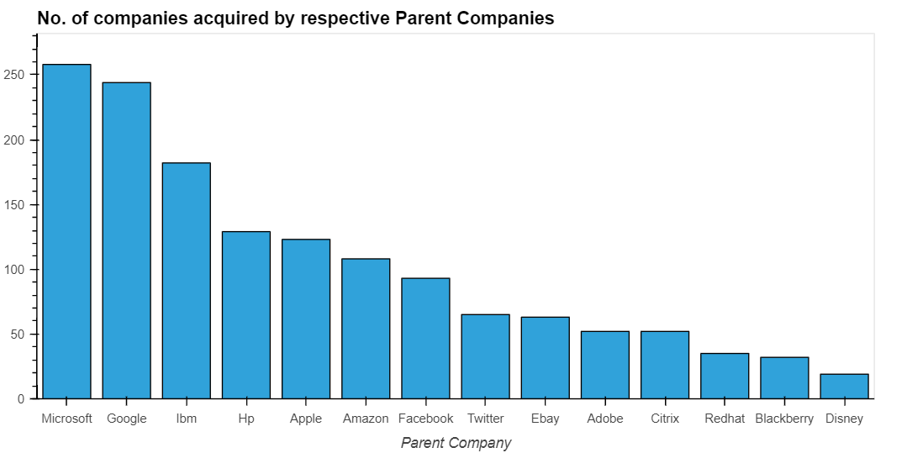
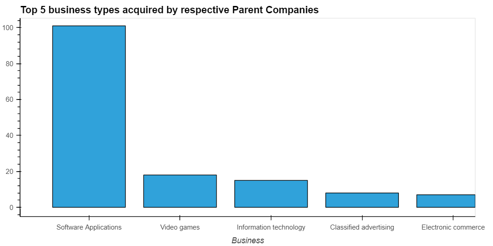

Project: <https://github.com/cedric130813/eda_analytics/blob/main/Merger%20and%20Acquisitions%20by%20Tech%20Companies.ipynb>

Source: [https://www.kaggle.com/datasets/shivamb/company-acquisitions-7-top-companie](https://www.kaggle.com/datasets/shivamb/company-acquisitions-7-top-companies)

The dataset contains the list of acquisitions made by the following companies from 1988 to 2021

> Microsoft, Google, IBM, Hp, Apple, Amazon, Facebook, Twitter, eBay, Adobe, Citrix, Redhat, Blackberry, Disney

**Examples of questions to explore in dataset:**

* Which parent company made the most number of acquisitions?

  Microsoft and Google acquired the most number of companies as both companies crossed the 200-number threshold. Microsoft's recent key acquisitions are video gaming company Activision Blizzard and code repository website GitHub; while Google's key acquisitions (under parent company Alphabet) are GPS navigation app Waze and sports wearable tracker company Fitbit.

* What are the 5 top business types acquired by parent companies? 

  The software industry is the most commonly acquired by parent companies, which includes data analytics platform Looker which was acquired by Google and SalesForce's acquisition of Slack in view of its peak during the pandemic remote-work climate.

* Which company makes the acquisitions quickly?
* What is the trend of business use-cases among the acquired companies throughout the years?
* What can be forecasted for upcoming years in terms of acquisitions?
* Predict who is likely to make next acquisitions and when?